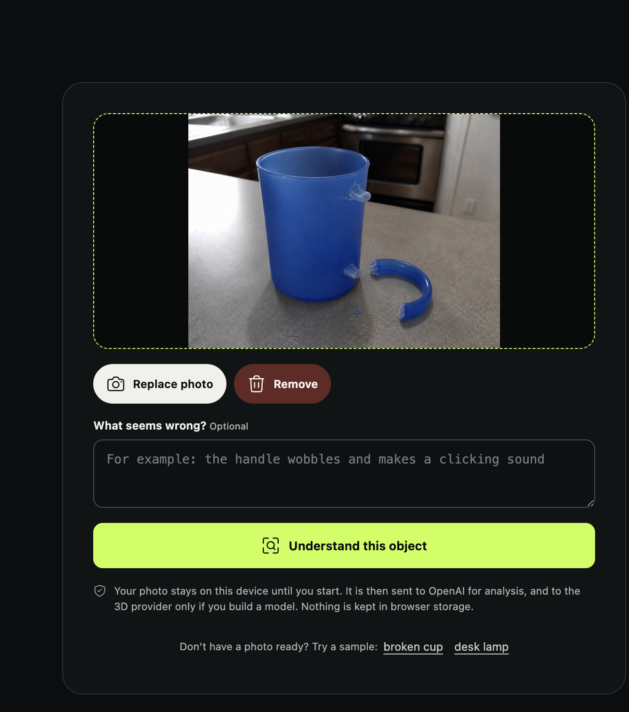
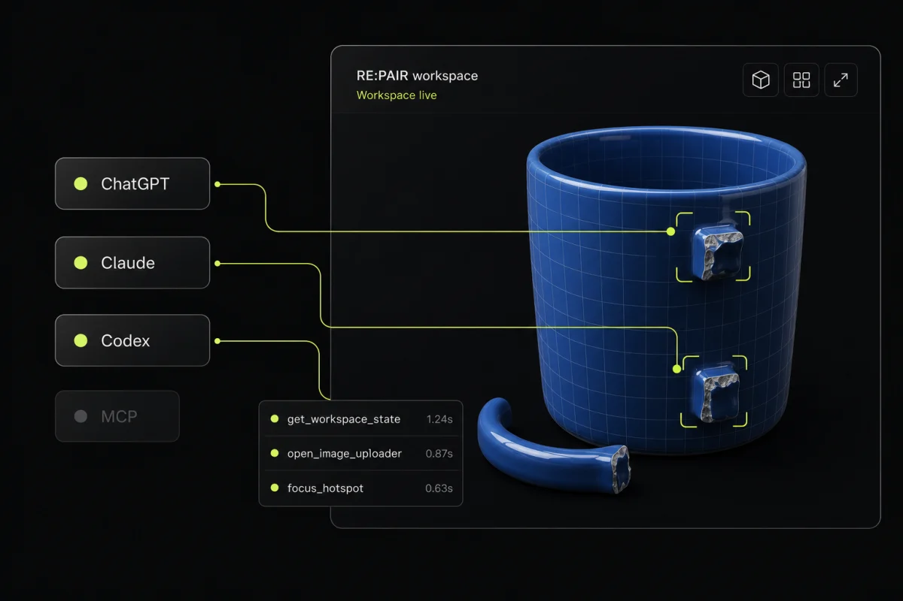
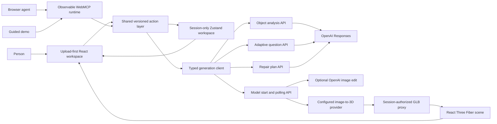
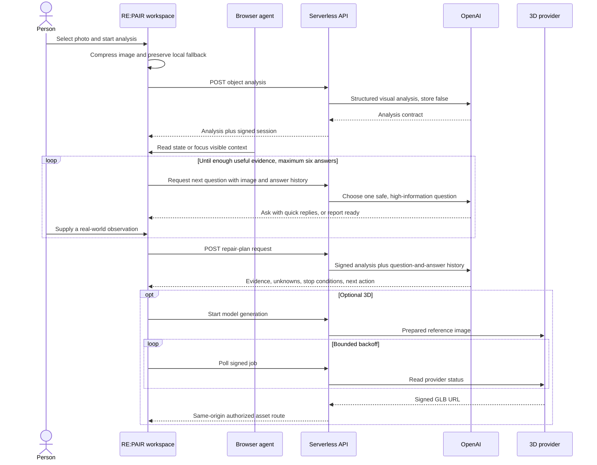

<div align="center">
  
  <h1>RE:PAIR</h1>
  <p><strong>Show what needs fixing. Understand the evidence. Choose a safer next step.</strong></p>
  <p>
    <a href="https://repair-webmcp.vercel.app"><strong>Live project</strong></a>
    ·
    <a href="https://github.com/appdever01/repair-webmcp">Source code</a>
    ·
    <a href="./docs/demo-script.md">Demo guide</a>
    ·
    <a href="./docs/generation-pipeline.md">Generation pipeline</a>
    ·
    <a href="./LICENSE">MIT License</a>
  </p>
</div>

RE:PAIR is a photo-first repair workspace shared by a person and a browser agent. A person selects an image of an everyday object, decides when it may be analyzed, supplies real-world observations, and keeps authority over every physical decision. The application contributes structured visual analysis, visible hypotheses, synchronized hotspots, cautious repair guidance, and an optional generated 3D view.

The product is deliberately evidence-led: it distinguishes what is visible from what is inferred, exposes uncertainty, and stops at qualified help when the object is unsafe to diagnose or repair remotely.

> [!IMPORTANT]
> RE:PAIR is decision support, not a substitute for professional inspection. Do not rely on a photo or generated plan for mains electricity, damaged batteries, gas systems, medical devices, weapons, structural systems, vehicle safety systems, unknown chemicals, or any situation where failure could cause injury or serious damage.

## Contents

- [See it in action](#see-it-in-action)
- [Product overview](#product-overview)
- [Quick start](#quick-start)
- [Using RE:PAIR](#using-repair)
- [Using RE:PAIR from Codex or ChatGPT](#using-repair-from-codex-or-chatgpt)
- [WebMCP tool reference](#webmcp-tool-reference)
- [Architecture](#architecture)
- [API and generation pipeline](#api-and-generation-pipeline)
- [Safety, privacy, and authority](#safety-privacy-and-authority)
- [Environment variables](#environment-variables)
- [Development and validation](#development-and-validation)
- [Deployment](#deployment)
- [Troubleshooting](#troubleshooting)
- [Project structure](#project-structure)
- [Contributor guidelines](#contributor-guidelines)
- [Limitations](#limitations)

## See it in action

<p align="center">
  
</p>

<p align="center"><em>The uploaded-photo review state keeps the image and problem description visible before analysis begins.</em></p>

<p align="center">
  
</p>

<p align="center"><em>WebMCP exposes the current page as a small, stage-aware set of tools while preserving the same human-facing workspace.</em></p>

Try the deployed application at **[repair-webmcp.vercel.app](https://repair-webmcp.vercel.app)**.

## Product overview

### What RE:PAIR does

1. Accepts one JPEG, PNG, or WebP photo and an optional description of the problem.
2. Keeps the initial preview local until the person chooses **Start analysis**.
3. Uses OpenAI to return structured object identification, visible condition, hypotheses, uncertainty, hotspots, and a safety classification.
4. Runs an adaptive visual interview: OpenAI chooses one image-specific question at a time, then uses each human answer to decide what to ask next or when to stop.
5. Drafts a cautious repair plan that includes supporting evidence, conflicting evidence, unknowns, limitations, stop conditions, and one recommended next action.
6. Optionally sends a prepared reference to Meshy and presents the returned GLB in an interactive 3D scene.
7. Makes appropriate page actions available to a WebMCP-capable browser agent.

### Core capabilities

| Capability | Behavior |
| --- | --- |
| Photo-first intake | Drag, drop, or choose a photo; preview it before anything is sent. |
| Adaptive interview | Validated image-specific questions, quick replies, human observations, and an explicit ready state. |
| Evidence-led guidance | Hypotheses retain evidence for, evidence against, and unresolved unknowns. |
| Safety stops | High-risk categories deterministically switch to professional-help-only guidance. |
| Progressive 3D | A generated model enhances the workspace but is never required for the repair path. |
| Visible WebMCP | Site-tool registration, calls, results, duration, and visible effects appear in the activity dock. |
| Human authority | The agent cannot select a local file, invent an observation, approve a plan, or claim physical completion. |
| Resilient fallback | The photo, semantic hotspots, questions, and guidance remain usable without WebGL, 3D generation, or WebMCP. |

### Technology

| Area | Stack |
| --- | --- |
| Interface | React 19, TypeScript, Vite, Motion |
| State | Zustand with a shared versioned action layer |
| Validation | Zod schemas and generated JSON Schema |
| 3D | Three.js, React Three Fiber, Drei |
| AI analysis, interview, and planning | OpenAI Responses API |
| Optional image preparation | OpenAI Image API |
| Optional image-to-3D | Meshy |
| Browser-agent integration | WebMCP through `document.modelContext` |
| Hosting | Vercel static output and serverless functions |
| Testing | Vitest, Testing Library, Playwright, axe-core |
| Quality | TypeScript, Biome, bundle budgets |

## Quick start

### Requirements

- Node.js 26
- pnpm 11.7.0
- Git
- Vercel CLI for a local full-stack run
- Chromium for end-to-end browser tests

### Install

```bash
git clone https://github.com/appdever01/repair-webmcp.git
cd repair-webmcp
pnpm install
```

### Run the interface only

```bash
pnpm dev
```

Vite serves the React interface and is sufficient for layout, component, and manual fallback work. It does **not** execute the Vercel functions under `api/object/`, so analysis and generation requests require the full-stack setup below.

### Run the complete flow without provider credits

1. Copy `.env.example` to `.env.local`.
2. Set `GENERATION_MOCK_MODE=true`.
3. Start the project with the Vercel CLI:

```bash
vercel dev
```

Development mock mode keeps the real validation, session binding, polling, UI transitions, and API response contracts. It replaces external OpenAI and Meshy calls with deterministic responses. Production always ignores mock mode.

### Run against real providers

Add these values to `.env.local`:

```dotenv
OPENAI_API_KEY=your_server_side_key
OPENAI_ANALYSIS_MODEL=an_image_capable_structured_output_model
OPENAI_IMAGE_MODEL=gpt-image-2
IMAGE_TO_3D_PROVIDER=meshy
MESHY_API_KEY=your_optional_meshy_key
SESSION_SIGNING_SECRET=a_random_value_at_least_32_bytes_long
GENERATION_MOCK_MODE=false
```

Then run:

```bash
vercel dev
```

Never expose provider credentials through `VITE_` variables. Variables prefixed with `VITE_` are bundled into browser JavaScript.

## Using RE:PAIR

### Manual workflow

1. Open the [live project](https://repair-webmcp.vercel.app) or a local full-stack instance.
2. Choose or drop one supported image.
3. Confirm the preview and optionally describe the symptom.
4. Select **Start analysis**.
5. Compare the original with the OpenAI damage map and select numbered areas for details.
6. Review the visible condition, safety status, and possible causes in the assessment drawer.
7. Correct the displayed object name if necessary.
8. Answer each AI-generated question from a real observation; every answer determines whether another question is useful.
9. When the AI interview reports that it has enough context, request and review cautious guidance, evidence, unknowns, and stop conditions.
10. Open the 3D tab to generate and explore a Meshy model when the safety category allows it.

### Choosing a useful photo

- Use even lighting and keep the damaged area in focus.
- Include enough of the object to identify it, not only an extreme close-up.
- Avoid reflections, heavy motion blur, screenshots of other photos, and unrelated background clutter.
- Capture labels or markings only when it is safe and useful.
- Do not handle, energize, dismantle, or reposition a hazardous object just to improve the image.
- A second angle is often more useful than a longer text description, but the current interface accepts one image per session.

### What the optional description should contain

Describe symptoms that a photo may not show, such as when the failure started, whether a part moves, a sound or smell, or whether the object was dropped. Do not include passwords, account information, access tokens, personal identifiers, or unrelated private data.

## Using RE:PAIR from Codex or ChatGPT

RE:PAIR exposes **WebMCP site tools**, not a standalone remote MCP server. The tools belong to the live page. They become discoverable only while RE:PAIR is open in a compatible built-in browser, and closing or navigating away from the page makes them unavailable.

Current platform behavior and availability are documented in OpenAI's [Site tools guide](https://learn.chatgpt.com/docs/webmcp).

### Codex built-in browser

1. Use the latest ChatGPT desktop app and make sure site tools are enabled under **Settings → Browser → Permissions**.
2. Open [RE:PAIR](https://repair-webmcp.vercel.app) in the built-in browser beside the Codex chat.
3. Open **Site tools** in the browser address bar and inspect **Available site tools**.
4. Ask Codex to read the workspace before requesting a mutation.
5. Choose the local photo yourself when the uploader opens.
6. Keep the page open while Codex focuses hotspots, opens questions, refreshes generation, or drafts guidance.
7. Review the visible activity record and the resulting UI change after every tool call.

An ordinary Codex chat with only the repository attached cannot discover these page-scoped tools. The live page must be open in the built-in browser. Site-tool availability also depends on the selected model, account rollout, workspace policy, and current application version.

### Suggested prompts

```text
Read the current RE:PAIR workspace state. Do not start or change anything.
```

```text
Open the image uploader. I will choose the local photo myself.
```

```text
Read the latest state, then start analysis of the photo I selected.
```

```text
List the visible hotspots, focus the handle attachment, and explain what changed on the page.
```

```text
Open the next unanswered observation request. Do not answer it for me.
```

```text
Draft cautious repair guidance from the analysis and my recorded observations. Call out unknowns and stop conditions.
```

### Chrome developer testing

For direct browser development, use a Chrome build with WebMCP testing support or the relevant origin trial:

1. Enable `chrome://flags/#enable-webmcp-testing` when your Chrome build exposes it.
2. Relaunch Chrome.
3. Install Google's [Model Context Tool Inspector](https://github.com/GoogleChromeLabs/webmcp-tools), or use another compatible browser agent.
4. Open the production or local URL.
5. Confirm that the activity dock reports a connection through `document.modelContext`.
6. Inspect and invoke the currently registered tools.

Without WebMCP, the complete human interface still works. **Preview guided activity** exercises the same action path locally and labels the activity source as `Guided demo`.

## WebMCP tool reference

The runtime always begins with a read operation and registers additional tools only when the current workspace state makes them valid.

| Tool | Type | Available when | Result |
| --- | --- | --- | --- |
| `get_workspace_state` | Read-only | Always | Returns a bounded public snapshot, state version, and currently available tools. |
| `open_image_uploader` | Mutation | No image or task is active | Focuses the visible uploader; the person must choose the file. |
| `analyze_uploaded_object` | Mutation | A person-selected image is ready | Starts image analysis. |
| `start_3d_generation` | Mutation | Analysis exists and generation is idle, failed, or cancelled | Starts an optional cancellable model task. |
| `get_generation_status` | Mutation | Generation is queued or processing | Refreshes the visible provider status. |
| `focus_hotspot` | Mutation | Analysis exposes one or more hotspots | Focuses a visible photo or model hotspot. |
| `explode_model` | Mutation | A model is loaded | Separates or reassembles visible model components. |
| `request_human_observation` | Mutation | An unanswered question exists | Opens a visible question without supplying an answer. |
| `draft_repair_plan` | Mutation | Analysis exists, the adaptive interview is complete, and no task is active | Drafts visible guidance for review. |
| `cancel_current_task` | Mutation | Analysis or generation is active | Requests cancellation through the shared action layer. |
| `undo_agent_action` | Mutation | A reversible browser-agent action exists | Reverses that action and records the reversal. |

Every mutating tool uses the latest `expectedStateVersion`. If the workspace changes between reading state and invoking an action, the runtime returns `STALE_STATE`; the agent must read the state again instead of guessing.

Tool registration is diff-based and stage-aware. Newly valid tools are registered, retired tools are unregistered, duplicate names are avoided, and an in-flight invocation finishes before a tool that retires itself is removed.

## Architecture



The person and agent use the same controller and state transitions. This avoids a hidden automation-only path: if a browser agent changes the workspace, the person sees the action, status, affected target, and outcome in the normal interface.



### State model

- Zustand owns one session-only workspace.
- Human controls and browser-agent tools call the same controller.
- Each successful mutation increments `stateVersion`.
- Tool inputs use strict schemas and reject unknown fields.
- Public tool results are bounded and sanitized.
- The activity dock stores safe summaries, not raw provider payloads or model reasoning.
- Cancellation propagates through compression, API requests, and provider polling where supported.

## API and generation pipeline

### Server routes

| Method | Route | Purpose | Authorization |
| --- | --- | --- | --- |
| `POST` | `/api/object/analyze` | Validate and analyze the uploaded image. | Exact same-origin browser request |
| `POST` | `/api/object/diagnostic` | Generate the wireframe damage-map comparison. | Bearer session token |
| `POST` | `/api/object/question` | Choose the next adaptive question or end the interview. | Bearer session token |
| `POST` | `/api/object/plan` | Draft a repair plan from signed analysis and the complete answer history. | Bearer session token |
| `POST` | `/api/object/model` | Validate the session and start optional image-to-3D generation. | Bearer session token |
| `GET` | `/api/object/model?jobId=…` | Poll a signed generation job. | Bearer session token |
| `GET` | `/api/object/asset?jobId=…` | Revalidate the job and stream the finished GLB from this origin. | Bearer session token |

### Analysis

The browser compresses the selected image, then the API validates:

- base64 structure and decoded byte size;
- JPEG, PNG, or WebP magic bytes;
- agreement between declared and detected media type;
- encoded image dimensions;
- maximum pixel count;
- same-origin request context.

OpenAI receives the image as a data URL and returns strict structured output with `store: false`. Image pixels, visible text, metadata, user text, and provider data are treated as untrusted evidence rather than instructions.

### Signed sessions

The analysis response includes a short-lived HMAC-signed session token. The token binds the session to hashes of the image and analysis. Provider task IDs are wrapped in separate opaque, session-bound job tokens. Uploaded image bytes and provider payloads are never embedded in those tokens.

### Optional 3D generation

- JPEG and PNG inputs can go directly to Meshy.
- WebP requires image normalization before Meshy because of the provider's supported input formats.
- A person may explicitly request normalization for JPEG or PNG.
- The generated scene is progressive enhancement; failure returns to the photo-led workflow.
- Meshy asset URLs are not exposed directly to the browser.
- The same-origin asset route revalidates the session, obtains a fresh signed provider URL, and streams `model/gltf-binary`.

For the complete provider sequence, contracts, error codes, and Meshy example, see [Dynamic object generation pipeline](./docs/generation-pipeline.md).

## Safety, privacy, and authority

### Human and agent responsibilities

| Capability | Person | Browser agent |
| --- | :---: | :---: |
| Select a local image | Yes | No |
| Decide when the selected image is analyzed | Yes | Yes, after the person selects it |
| Correct the displayed object name | Yes | No |
| Focus a visible hotspot | Yes | Yes |
| Make or record a physical observation | Yes | No |
| Open an unanswered observation request | Yes | Yes |
| Start or cancel analysis and generation | Yes | Yes |
| Draft cautious guidance | Yes | Yes |
| Approve a repair or claim physical completion | Yes | No tool |

### Deterministic safety stops

The analysis contract can identify ordinary objects, mains electricity, damaged batteries, gas systems, medical devices, weapons, structural systems, vehicle safety systems, and unknown chemicals. Every non-ordinary high-risk category forces professional-help-only output, removes actionable repair steps, and preserves an explicit reason for the stop.

### Data handling

- The original `File` remains in memory only until generation reaches a terminal state or the task is cancelled.
- The compressed image stays in the current session for retry and planning.
- Object URLs are revoked when an image is replaced, removed, reset, or unmounted.
- No image, token, answer, activity, or provenance record is written to `localStorage`.
- The server does not write uploaded images, jobs, or provider payloads to a database, object store, or application log.
- OpenAI and Meshy process data under their own account configuration and data policies.
- OpenAI Responses requests use `store: false`.

### Logging and redaction

The application does not log image base64, prompts, bearer tokens, signing secrets, provider credentials, raw provider responses, or signed asset URLs. The activity dock shows bounded input and output summaries, stable public IDs, duration, phase, state transitions, and affected visible targets. It never exposes chain-of-thought.

## Image limits and lifecycle

The browser accepts source files up to 24 MB, creates an immediate object-URL preview, resizes the long edge to at most 2,048 pixels, and produces a JPEG below 2.9 MB for analysis.

The API independently enforces:

- decoded payload: at most 3,000,000 bytes;
- width or height: at most 16,384 pixels;
- total image area: at most 40 million pixels;
- supported media: JPEG, PNG, or WebP;
- type consistency: declared MIME type must match the detected file bytes.

Polling uses bounded exponential backoff and a fixed attempt ceiling. Terminal errors return control to the photo instead of leaving an empty visual area.

## Environment variables

Copy `.env.example` to `.env.local` for local full-stack development. Configure production values in Vercel, never in tracked files.

| Variable | Required | Default | Purpose |
| --- | --- | --- | --- |
| `OPENAI_API_KEY` | Analysis and planning outside mock mode | None | Server-side OpenAI credential. |
| `OPENAI_ANALYSIS_MODEL` | Analysis and planning outside mock mode | None | Account-accessible model supporting image input and Structured Outputs. |
| `OPENAI_IMAGE_MODEL` | Damage map outside mock mode | None | GPT Image edit model used for the diagnostic comparison and optional normalization. |
| `IMAGE_TO_3D_PROVIDER` | No | `meshy` | Image-to-3D provider; mock mode overrides it locally. |
| `MESHY_API_KEY` | Optional 3D outside mock mode | None | Server-side Meshy credential. |
| `SESSION_SIGNING_SECRET` | Production | Development-only fallback locally | Random signing value of at least 32 bytes in production. |
| `SESSION_TTL_SECONDS` | No | `1800` | Session and job lifetime; maximum accepted value is 3,600 seconds. |
| `OPENAI_TIMEOUT_MS` | No | `120000` | Per-request OpenAI timeout; maximum accepted value is 150,000 ms. |
| `IMAGE_TO_3D_TIMEOUT_MS` | No | `20000` | Per-request provider timeout; maximum accepted value is 60,000 ms. |
| `GENERATION_MOCK_MODE` | Local testing only | `false` | Enables deterministic providers outside production. Ignored in production. |

## Development and validation

### Commands

| Command | Purpose |
| --- | --- |
| `pnpm dev` | Start the Vite front-end development server. |
| `pnpm build` | Type-check and create the production build in `dist/`. |
| `pnpm preview` | Serve the existing production build locally. |
| `pnpm typecheck` | Run the TypeScript project build without pretty output. |
| `pnpm test` | Run all Vitest suites with at most two workers. |
| `pnpm test:domain` | Run domain tests. |
| `pnpm test:webmcp` | Run WebMCP schema, lifecycle, and trace tests. |
| `pnpm test:ui` | Run component and workspace-flow tests. |
| `pnpm test:coverage` | Generate test coverage. |
| `pnpm test:e2e` | Run desktop, mobile, accessibility, and WebMCP Playwright coverage. |
| `pnpm check` | Run Biome checks. |
| `pnpm format` | Format the repository with Biome. |
| `pnpm schema` | Regenerate the repair graph JSON Schema. |
| `pnpm budget` | Enforce JavaScript and media bundle budgets. |

### Recommended validation order

Run focused tests while developing, then the full gates before opening a pull request:

```bash
pnpm test
pnpm typecheck
pnpm check
pnpm build
pnpm budget
git diff --check
```

To run browser coverage:

```bash
pnpm exec playwright install chromium
pnpm build
pnpm test:e2e
```

The WebMCP Playwright project launches Chromium with `--enable-features=WebMCPTesting`, reads `document.modelContext.getTools()`, invokes real registered callbacks, verifies visible UI changes, exercises stale-state rejection, and tests an undo action that retires itself.

### Performance budgets

- Initial application JavaScript: 150 KB gzip
- Deferred 3D scene JavaScript: 450 KB gzip
- Product and social media: 1.5 MB total

## Deployment

The repository is configured for Vercel with a Vite build, `dist` output, and cancellable serverless functions under `api/object/*.ts`.

### Vercel setup

1. Import `https://github.com/appdever01/repair-webmcp` into Vercel.
2. Keep the framework preset as Vite.
3. Confirm the build command is `pnpm build`.
4. Confirm the output directory is `dist`.
5. Add production environment variables from the table above.
6. Set a cryptographically random `SESSION_SIGNING_SECRET` of at least 32 bytes.
7. Leave `GENERATION_MOCK_MODE` disabled; production ignores it regardless.
8. Configure rate limits or Vercel Firewall rules for `/api/object/analyze`, `/api/object/question`, `/api/object/diagnostic`, `/api/object/model`, and `/api/object/plan`.
9. Deploy and verify the home page, analysis and adaptive-interview paths, plan path, optional model polling, and same-origin GLB stream.
10. Open the deployed page in a compatible built-in browser and confirm the expected site tools appear for the current stage.

### WebMCP origin requirements

The production page contains a WebMCP origin-trial token tied to `https://repair-webmcp.vercel.app`. If the application moves to a custom domain, register the new origin and replace the token unless the target browser provides native WebMCP support without the trial. Tool registration must run in the top-level page; tools inside iframes are not discovered by the current built-in browser implementation.

### Post-deploy smoke checks

```bash
curl -I https://repair-webmcp.vercel.app
```

Then confirm:

- the page returns `200`;
- the production bundle loads without console errors;
- image selection and removal stay local;
- **Start analysis** reaches the configured API;
- the activity dock reports either a WebMCP connection or a clear manual fallback;
- no credential or signed provider URL appears in browser-visible output;
- a failed 3D request leaves the photo and repair guidance usable.

## Troubleshooting

| Symptom | Likely cause | What to check |
| --- | --- | --- |
| Site tools do not appear in Codex | The page is not open in the built-in browser, site tools are disabled, the model/account lacks availability, or the origin trial is invalid. | Keep RE:PAIR open, inspect **Site tools**, review browser permissions, update the app, and verify the deployed origin token. |
| UI loads but analysis returns 404 locally | Vite does not run Vercel functions. | Use `vercel dev` for the complete flow. |
| `CONFIGURATION_ERROR` | A required provider value or production signing secret is missing or invalid. | Check server-side environment variables and redeploy. |
| `ORIGIN_NOT_ALLOWED` | The request did not come from the exact application origin. | Keep UI and API on the same origin and avoid cross-origin proxies. |
| `INVALID_IMAGE` or `MIME_MISMATCH` | The file bytes, media type, dimensions, or size failed validation. | Re-export a supported JPEG, PNG, or WebP within the documented limits. |
| `STALE_STATE` from a site tool | The workspace changed after the agent's last read. | Invoke `get_workspace_state`, then retry with the returned version. |
| 3D generation is unavailable | Meshy is not configured, the session expired, or the safety state prevents the action. | Verify `MESHY_API_KEY`, read the latest workspace state, and review the safety stop. |
| Generation remains queued or processing | Provider work is still active or polling was interrupted. | Use the visible refresh action, check provider status, and respect the bounded timeout. |
| GLB fails after generation succeeds | The session/job token expired or the same-origin asset route failed. | Restart the optional model task and inspect the sanitized server error. Do not use the raw provider URL. |
| No WebGL or model rendering | GPU/WebGL support is unavailable or the model failed to load. | Continue with the photo, semantic hotspot list, questions, and guidance. |
| WebMCP registration error | Browser API mismatch or rejected tool registration. | Check the activity dock, top-level `document.modelContext`, schemas, and browser compatibility tests. |

Stable API error codes and provider-specific failure behavior are documented in [docs/generation-pipeline.md](./docs/generation-pipeline.md#failure-modes).

## Accessibility and resilience

- All critical information remains available without the 3D canvas.
- Photo hotspots have synchronized semantic controls.
- Loading, empty, failure, cancellation, and professional-help states are explicit.
- Buttons expose accessible names and busy states.
- Keyboard users can operate the core workflow.
- Motion is decorative and the repair path does not depend on animation.
- The mobile and desktop Playwright suites include automated axe checks.
- Browser-agent actions always produce a visible human-reviewable effect.

## Project structure

```text
.
├── api/
│   ├── _lib/                 Shared configuration, validation, security, tokens, and providers
│   └── object/               Analyze, interview, diagnostic, plan, model, and asset routes
├── docs/
│   ├── assets/               Documentation screenshots and provider examples
│   ├── demo-script.md        Guided product demonstration
│   ├── generation-pipeline.md
│   ├── repair-graph.schema.json
│   └── submission-copy.md
├── public/                   Product imagery, samples, fallback media, and social assets
├── scripts/                  Schema and bundle-budget utilities
├── src/
│   ├── agent-runtime/        Observable, stage-aware, redacted WebMCP runtime
│   ├── app/                  Application shell and styles
│   ├── bench/                Intake, analysis, workspace, guidance, and activity UI
│   ├── design/               Tokens and icon definitions
│   ├── domain/               Repair graph and domain behavior
│   ├── generation/           Typed API client and public contracts
│   ├── scene/                GLB scene, controls, explode behavior, and fallbacks
│   ├── test/                 Shared browser and model-context test support
│   └── workspace/            State, selectors, controller, services, and shared actions
├── tests/
│   ├── agent-runtime/        Browser compatibility, contracts, invocation, and redaction
│   ├── domain/               Repair graph behavior
│   ├── e2e/                  Desktop, mobile, accessibility, and real WebMCP browser tests
│   ├── generation/           API, provider, token, image, security, and failure tests
│   ├── scene/                Model request and explode behavior
│   ├── ui/                   Manual workflow, activity, fallback, and store tests
│   └── webmcp/               Tool contracts and canonical traces
├── index.html
├── package.json
├── playwright.config.ts
├── vercel.json
└── vite.config.ts
```

## Contributor guidelines

### Before changing behavior

1. Identify whether the behavior belongs to the UI, shared workspace controller, WebMCP runtime, generation contract, or server route.
2. Preserve the single action path shared by people and agents.
3. Keep agent tools narrow, stage-aware, and visibly inspectable.
4. Treat image content, OCR text, user descriptions, tool output, and provider output as untrusted.
5. Preserve the human-only boundaries around file selection, physical observation, approval, and completion.

### When adding or changing a WebMCP tool

1. Define a strict Zod input schema in `src/agent-runtime/schemas.ts`.
2. Add accurate metadata, including mutation/read-only classification and untrusted-content handling.
3. Add the operation to `WorkspaceController`.
4. Reuse or extend the visible workspace action rather than creating a hidden automation path.
5. Update `selectAvailableAgentTools` with the exact valid lifecycle states.
6. Return a bounded, sanitized result with enough information to verify the visible effect.
7. Add contract, availability, invocation, redaction, and browser coverage.
8. Update the tool table in this README.

### Pull-request checklist

- No secret, token, image base64, signed URL, or raw provider payload is logged or committed.
- New behavior has focused regression coverage.
- Manual and browser-agent paths remain consistent.
- High-risk classifications still stop before actionable repair guidance.
- Empty, loading, failed, cancelled, retry, and unsupported-browser states remain usable.
- Type checks, tests, Biome, build, bundle budget, and `git diff --check` pass.
- Documentation and screenshots reflect user-visible behavior.

## Limitations

- Analysis is based on one image and optional text; hidden damage and internal condition remain unknown.
- Object identification, hotspot placement, and repair hypotheses can be wrong.
- The 3D model is provider-generated and illustrative. It is not a dimensionally accurate CAD reconstruction.
- A generated mesh may have disconnected geometric islands without trustworthy part names or hotspot anchors.
- Signed sessions expire and the application does not persist a workspace across reloads.
- Provider availability, latency, quotas, policies, and asset retention are outside this repository's control.
- WebMCP support varies by browser, model, account rollout, and workspace policy.
- The built-in browser currently discovers top-level JavaScript-registered tools, not declarative form tools or tools inside iframes.

## Further documentation

- [Demo script](./docs/demo-script.md)
- [Dynamic object generation pipeline](./docs/generation-pipeline.md)
- [Submission and product copy](./docs/submission-copy.md)
- [Repair graph JSON Schema](./docs/repair-graph.schema.json)
- [OpenAI Site tools documentation](https://learn.chatgpt.com/docs/webmcp)
- [WebMCP proposal](https://webmachinelearning.github.io/webmcp/)
- [Google Model Context Tool Inspector](https://github.com/GoogleChromeLabs/webmcp-tools)

## License

RE:PAIR is available under the [MIT License](./LICENSE).
