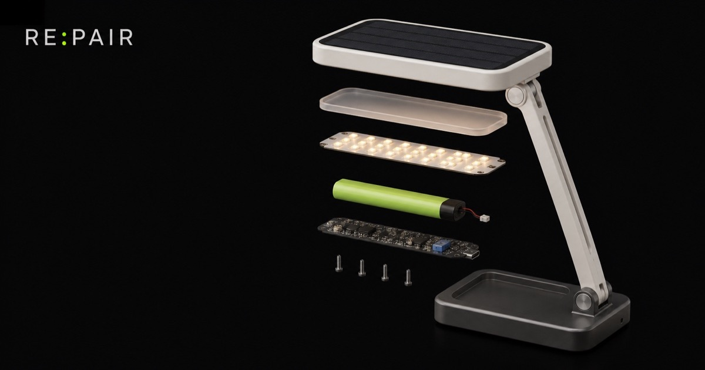
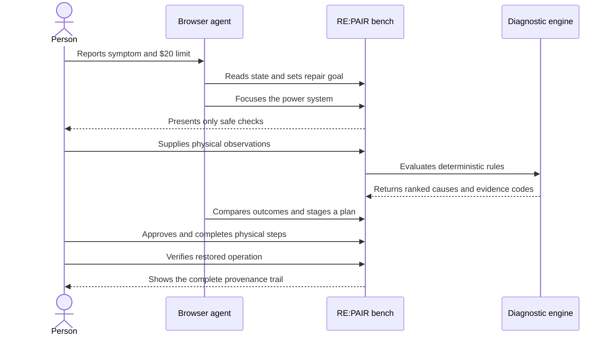
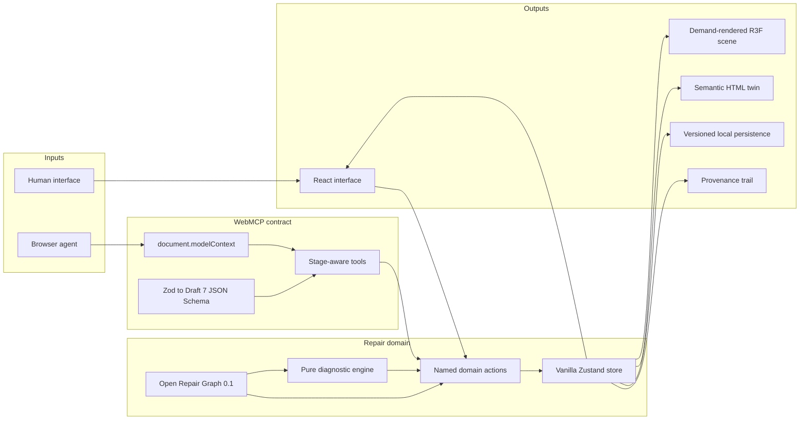
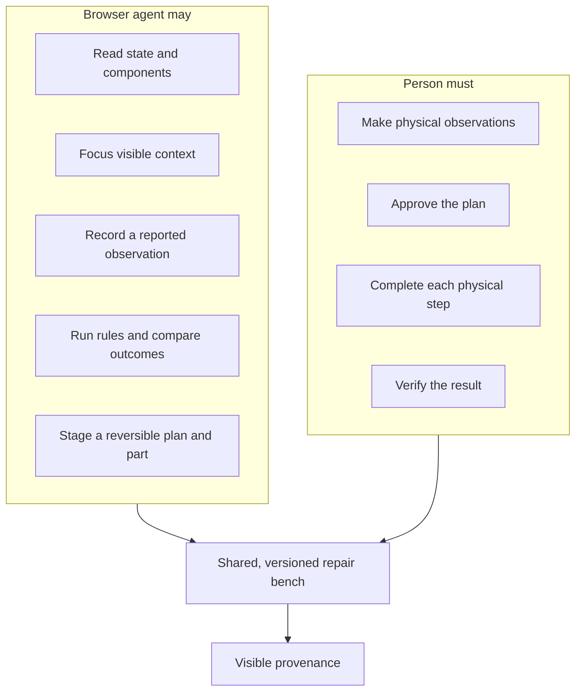
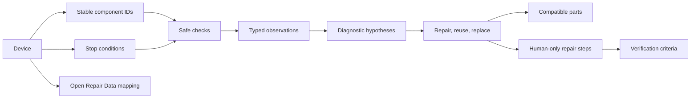

<div align="center">
  

  <h1>RE:PAIR</h1>

  <p><strong>A living 3D repair manual for people and browser agents.</strong></p>
  <p>The agent understands the machine. You bring the observations, judgment, approval, and hands.</p>

  <p>
    <a href="https://repair-webmcp.vercel.app"><strong>Open the live repair bench</strong></a>
    ·
    <a href="./src/content/aurelia-s1.repair-graph.json">Inspect the Repair Graph</a>
    ·
    <a href="./docs/demo-script.md">Run the demo</a>
  </p>
</div>

## The repair in one prompt

Open the live app and give a WebMCP-capable browser agent this exact prompt:

> It charges but dies after five minutes. Help me fix it for under $20.

The agent reads the visible bench, narrows the relevant components, stages safe checks, records the person's observations, runs deterministic fault rules, compares outcomes, and prepares a compatible repair plan. The person remains responsible for every physical observation, approval, repair step, and verification.

No browser agent is required. Select `Explore manually` to complete the same repair through the interface.

## Why RE:PAIR exists

Repair knowledge is usually split across manuals, videos, forum posts, and part listings. A person has the object but may not know the system. An agent can reason over structured knowledge but cannot hold a probe, smell a burnt component, inspect a loose wire, or accept physical risk.

RE:PAIR gives both sides one inspectable workspace. The competition build follows a fictional Aurelia S1 solar study lamp from a short-runtime symptom to a verified battery replacement. It is intentionally one complete repair, not a shallow device catalogue.



## What makes the demo work

- A semantic, interactive 3D lamp with a mechanically coherent exploded view.
- Twelve narrow WebMCP tools registered on the top-level document.
- Stage-aware tool availability, strict schemas, cancellation checks, and optimistic versioning.
- A pure diagnostic engine that returns the same ranking for the same observations.
- A shared action layer used by the React interface and WebMCP handlers.
- Explicit provenance for human actions, agent actions, state versions, and reversals.
- Repair, wired reuse, and whole-device replacement compared by cost, time, risk, and waste.
- A complete manual path when WebMCP is absent.
- A semantic HTML twin and static fallback when WebGL is unavailable.
- No backend, account, API key, analytics service, or remote runtime data source.

## System architecture



The Repair Graph is parsed once at the domain boundary. Zod validates graph data and tool inputs, then generates the strict Draft 7 schemas exposed to WebMCP. The diagnostic engine has no dependency on time, randomness, UI state, or network state. React and WebMCP call the same store actions, so an agent action always changes the interface the person can see.

## Human and agent authority



There is no tool for approval, purchase, physical-step completion, or final verification. The agent can stage and explain. The person must observe, approve, act, and verify.

| Capability | Person | Browser agent |
| --- | :---: | :---: |
| Read state and inspect components | Yes | Yes |
| Focus the visible repair bench | Yes | Yes |
| Record a reported observation | Yes | Yes |
| Run deterministic diagnosis | Yes | Yes |
| Compare repair outcomes | Yes | Yes |
| Stage a plan and compatible part | Yes | Yes |
| Approve the repair plan | Yes | No tool |
| Complete a physical step | Yes | No tool |
| Verify the physical result | Yes | No tool |
| Purchase a part | No checkout | No tool |

## WebMCP tool surface

RE:PAIR follows the current [WebMCP imperative API](https://developer.chrome.com/docs/ai/webmcp/imperative-api). Tools register through `document.modelContext` on the top-level page. Read tools remain broadly discoverable, while write tools appear only when their stage preconditions are satisfied.

| Tool | Kind | Purpose |
| --- | --- | --- |
| `get_bench_state` | Read | Return the current stage, version, progress, and allowed next actions. |
| `set_repair_goal` | Write | Record the known symptom and maximum USD budget. |
| `inspect_component` | Read | Return a component's role, evidence, status, and checks. |
| `focus_component` | Write | Select a known component on the visible bench. |
| `list_safe_checks` | Read | Return checks whose prerequisites and safety rules are satisfied. |
| `record_observation` | Write | Store a structured human-reported or simulated observation. |
| `diagnose_faults` | Read | Run deterministic rules and return ranked causes with evidence. |
| `compare_repair_options` | Read | Compare repair, reuse, and replacement against the stored limit. |
| `stage_repair_plan` | Write | Prepare a reversible plan for human review. |
| `focus_repair_step` | Write | Focus one instruction and its related components without completing it. |
| `stage_part_cart` | Write | Stage a compatible fictional part locally without purchasing it. |
| `undo_agent_action` | Write | Reverse the latest eligible agent write and record the reversal. |

Every visible write requires an `expectedStateVersion`, checks its `AbortSignal` before mutation, validates input with a strict schema, and records provenance. Individual serialized results are capped below 1,500 characters.

## Open Repair Graph 0.1

The graph connects machine structure, safe observation, diagnosis, outcomes, parts, repair steps, 3D focus, and provenance without accepting executable instructions or free-form agent prompts as data.



The validated fixture lives at [`src/content/aurelia-s1.repair-graph.json`](./src/content/aurelia-s1.repair-graph.json). Its generated schema is [`docs/repair-graph.schema.json`](./docs/repair-graph.schema.json). Stable component IDs are shared by geometry, labels, checks, hypotheses, plan steps, focus targets, and the semantic text view.

### Deterministic diagnosis

| Human observation | Diagnostic effect |
| --- | --- |
| Charge indicator is steady green | Lowers charge-controller failure. |
| Battery reads 3.26 V with the lamp off | Shows that the cell accepts surface charge. |
| Battery falls to 2.31 V under load | Strongly raises high internal resistance. |
| Battery rebounds to 3.08 V after switch-off | Confirms the voltage-sag pattern. |

The result is `Likely cause: battery cell wear`, accompanied by evidence for and against each hypothesis. RE:PAIR does not invent probability-like confidence values for a rules-based result.

## 3D scene and accessible twin

<div align="center">
  
</div>

The canvas is an enhancement, not the only interface. A synchronized HTML component hierarchy exposes the same selection, component state, diagnostic status, and focus actions. If WebGL fails, the static render above preserves product context while the full manual workflow remains available.

The interface also includes visible focus, 44 px targets, live announcements, keyboard controls, reduced-motion behavior, color-independent state labels, mobile layouts, and support for 200 percent zoom.

React Three Fiber runs the scene in demand mode, so the renderer sleeps while the workbench is still. Procedural geometry keeps semantic component boundaries intact and removes the need for a large external 3D asset.

## Safety model

The Aurelia S1, its values, and its parts are fictional. RE:PAIR is an interactive simulation, not live electrical instruction for a real product.

Swelling, heat, physical damage, odor, corrosion, or damaged insulation stops the guided path. The experience never instructs a person to puncture, heat, bend, short, or open a battery cell. A stop condition outranks progress through the demo.

## Technology

| Layer | Choice |
| --- | --- |
| Application | React 19, TypeScript 7, Vite 8 |
| 3D | Three.js, React Three Fiber, Drei |
| State | Vanilla Zustand store with React selectors |
| Validation | Zod with generated Draft 7 JSON Schema |
| Motion | Motion with shared reduced-motion policy |
| Icons | Private licensed IconJar catalogue through one semantic wrapper |
| Browser-agent contract | WebMCP imperative API |
| Unit and integration tests | Vitest, Testing Library, jsdom |
| Browser coverage | Playwright and axe-core |
| Code quality | Biome and TypeScript project references |
| Hosting | Static Vercel deployment |

## Run locally

Requirements:

- Node.js 26
- pnpm 11.7.0

```bash
pnpm install
pnpm dev
```

No login, API key, backend, or remote data source is required. Vite prints the local URL when the development server starts.

## Validation

```bash
pnpm test:domain
pnpm test:webmcp
pnpm test:ui
pnpm typecheck
pnpm check
pnpm build
pnpm budget
```

The focused suites cover graph validation, the canonical battery diagnosis, a stable-voltage counterexample, safety stops, stale and cancelled writes, incompatible parts, agent undo, dynamic tool registration, output limits, the complete manual path, and the complete mocked WebMCP path.

Playwright and axe coverage is available through `pnpm test:e2e` and is capped at two workers.

### Performance budgets

| Boundary | Budget |
| --- | ---: |
| Initial application, gzip | 150 KB |
| Deferred 3D scene, gzip | 450 KB |
| Product and social assets | 1.5 MB |

`pnpm budget` reads the production manifest, calculates dependency closures, compresses emitted bundles, and exits nonzero if any boundary is exceeded.

## Project map

```text
src/
├── app/                 Application shell and global layout
├── bench/               Repair panels, controls, and provenance UI
├── content/             Validated Aurelia S1 Repair Graph
├── design/              Tokens and interface iconography
├── domain/              Schemas, state, actions, diagnosis, persistence
├── scene/               Procedural lamp, camera, motion, quality policy
└── webmcp/              Tool schemas, registration, handlers, results
tests/
├── domain/              Graph, store, and diagnostic rules
├── e2e/                 Manual path and accessibility browser coverage
├── scene/               Motion policy
├── ui/                  Complete manual workflow
└── webmcp/              Contracts and canonical agent trace
docs/                    Schema, demo script, and submission copy
evals/                   Deterministic prompts and expected traces
scripts/                 Schema generation and bundle budgets
public/                  Social card and WebGL fallback imagery
```

## Production

The app is deployed at [repair-webmcp.vercel.app](https://repair-webmcp.vercel.app).

Build the production output with:

```bash
pnpm build
```

Deploy the linked project with:

```bash
vercel --prod
```

Vercel serves the static Vite output with the security headers declared in [`vercel.json`](./vercel.json).

## Submission resources

- [`docs/demo-script.md`](./docs/demo-script.md) contains the timed 2 minute 45 second demo.
- [`docs/submission-copy.md`](./docs/submission-copy.md) contains short and full competition descriptions.
- [`evals/prompts.json`](./evals/prompts.json) contains repeatable evaluation prompts.
- [`evals/expected-traces.json`](./evals/expected-traces.json) contains deterministic expected traces.
- [`REPAIR_MASTER_PLAN.md`](./REPAIR_MASTER_PLAN.md) records product decisions, constraints, and acceptance criteria.

## License and assets

Code and original project assets are available under the [MIT License](./LICENSE). Interface icons come from the separately licensed private IconJar package and are not covered by the MIT License. The procedural 3D model and product imagery are original. The fallback lamp and social imagery were created specifically for RE:PAIR with OpenAI image generation. No third-party model, texture, product content, analytics script, or runtime CDN asset ships with the application. See [`NOTICE.md`](./NOTICE.md).
