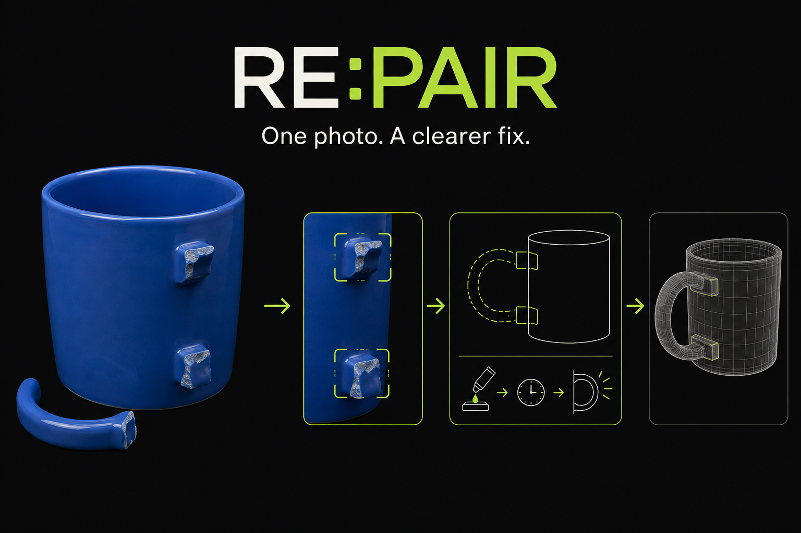
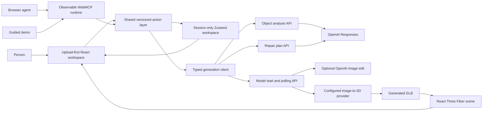
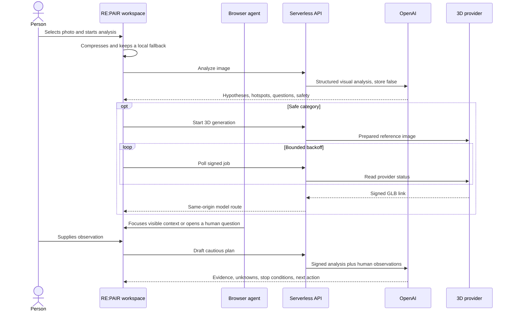

<div align="center">
  
  <h1>RE:PAIR</h1>
  <p><strong>Show what needs fixing. Understand the evidence. Choose a safer next step.</strong></p>
  <p><a href="https://repair-webmcp.vercel.app"><strong>Open RE:PAIR</strong></a> · <a href="./docs/demo-script.md">Demo script</a> · <a href="./docs/generation-pipeline.md">Generation pipeline</a></p>
</div>

RE:PAIR turns a photo of an everyday object into a shared repair workspace for a person and a browser agent. The person chooses the image, decides when it is sent for analysis, corrects what the system understood, supplies real-world observations, and retains authority over every physical decision. The system provides visible hypotheses, synchronized hotspots, an optional generated 3D view, and cautious next-step guidance.

The sample lamp remains available as a fallback, but the product is no longer limited to one scripted object.

## Product flow

1. Choose or drop a JPEG, PNG, or WebP image and optionally describe the problem.
2. Review the local preview. Nothing leaves the browser until the person starts the analysis.
3. OpenAI returns structured identification, visible condition, possible issues, uncertainty, hotspots, questions, and a safety classification.
4. The configured image-to-3D provider receives a clean reference and returns a GLB when generation succeeds.
5. The person answers clarifying questions through visible controls.
6. OpenAI drafts cautious guidance. High-risk objects stop on a deterministic professional-help path.

The canvas is an enhancement. The uploaded photo, hotspot buttons, semantic hotspot list, questions, and repair guidance remain usable if generation fails, a model link expires, or WebGL is unavailable. Finished models are streamed through a same-origin, session-authorized route because the provider CDN does not send CORS headers.

## Architecture



The server does not store uploaded images, jobs, or provider payloads. It validates image bytes and dimensions, binds the image and analysis to a short-lived signed session, wraps provider job IDs in opaque signed tokens, and returns only validated public contracts. OpenAI analysis uses `store: false`. OpenAI and the configured 3D provider still process the image under their respective data policies.



## Visible browser-agent activity

The activity dock is always discoverable. It shows the currently available action count and groups each invocation into one visible record with:

- `Browser agent` or `Guided demo` source labeling;
- requested, running, succeeded, failed, or cancelled state;
- timestamp and elapsed time;
- bounded, redacted input and result summaries;
- the visible workspace target and resulting change.

The runtime never displays chain-of-thought, image base64, credentials, bearer/session tokens, or signed provider URLs. Every mutating browser-agent action changes visible state. An agent can open the uploader but cannot choose a local file; it can open a question but cannot answer for the person; it can draft guidance but cannot approve or mark physical work complete.

The dock also reports the connection: `Browser agent connected through document.modelContext` with the number of tools registered for the current step, or a note that this browser has no WebMCP and every control works by hand. The same product path remains usable through human controls either way.

## Try it with a browser agent

WebMCP ships behind a flag in Chrome 150 and newer and through a Chrome origin trial.

1. Open `chrome://flags/#enable-webmcp-testing`, set it to Enabled, and relaunch Chrome.
2. Install Google's [Model Context Tool Inspector](https://github.com/GoogleChromeLabs/webmcp-tools) or any agent that speaks WebMCP.
3. Open the production URL. The activity dock reports the connection and lists the tools registered for the current step.
4. Ask the agent to read the workspace state and open the image uploader, choose a photo yourself, then ask it to focus a hotspot or draft the guidance.

Without a WebMCP browser, `Preview guided activity` inside the dock runs the same tool path locally and labels it `Guided demo`.

The runtime prefers `document.modelContext` and falls back to the older `navigator.modelContext`. Registration is diff-based: only newly available tools are registered and only retired tools are unregistered, so the browser never sees a duplicate name, and a refresh waits for in-flight calls so a mutation that retires its own tool still returns its result. Real-browser behavior is exercised by the `webmcp` Playwright project in `tests/e2e/webmcp.spec.ts`, which launches Chromium with `--enable-features=WebMCPTesting` and drives `document.modelContext.getTools()` and `executeTool()` against the built app: registration, a successful mutation, a stale-version rejection, and an undo that retires its own tool.

## Safety and authority

Analysis and repair causes are always presented as hypotheses. Guidance includes evidence for, evidence against, unknowns, limitations, and stop conditions before any step. Mains electricity, damaged batteries, gas systems, medical devices, weapons, structural systems, vehicle safety systems, and unknown chemicals can force a professional-help-only stop.

| Capability | Person | Browser agent |
| --- | :---: | :---: |
| Select a local image and send it for analysis | Yes | No |
| Correct the displayed object name | Yes | No |
| Focus a visible hotspot | Yes | Yes |
| Make and record a physical observation | Yes | No |
| Open an unanswered observation request | Yes | Yes |
| Start or cancel analysis and generation | Yes | Yes |
| Draft cautious guidance | Yes | Yes |
| Approve or complete physical work | Yes | No tool |

## Image and lifecycle behavior

The browser accepts source images up to 24 MB, renders an immediate object-URL preview, then downsizes the long edge to at most 2,048 pixels and encodes JPEG below 2.9 MB. The API independently enforces a 3,000,000-byte decoded limit, a 16,384-pixel per-dimension limit, and a 40-million-pixel limit.

The original `File` remains only in memory until generation reaches a terminal state or the task is cancelled. The compressed image remains available in the current session for retry and planning. Object URLs are revoked when replaced, removed, reset, or unmounted. No uploaded image, signed token, answer, or provenance entry is written to `localStorage`.

Generation polling uses bounded exponential backoff and a fixed attempt ceiling. `AbortController` cancellation propagates through compression and API requests. Terminal failures return to the interactive photo instead of leaving a blank visual area.

## Environment

Production requires these server-side variables:

| Variable | Requirement |
| --- | --- |
| `OPENAI_API_KEY` | Required OpenAI server credential. |
| `OPENAI_ANALYSIS_MODEL` | Required model with image input and Structured Outputs support. |
| `IMAGE_TO_3D_PROVIDER` | Required; currently `meshy`. |
| `MESHY_API_KEY` | Required Meshy server credential. |
| `SESSION_SIGNING_SECRET` | Required random value of at least 32 bytes. |

Optional variables are `OPENAI_IMAGE_MODEL`, `SESSION_TTL_SECONDS`, `OPENAI_TIMEOUT_MS`, and `IMAGE_TO_3D_TIMEOUT_MS`. `GENERATION_MOCK_MODE=true` enables deterministic local generation outside production and is ignored in production.

Abuse protection is deployment configuration, not a browser-visible secret. Before enabling the production pipeline, configure and verify suitable Vercel Firewall/rate-limiting controls for the three API routes. Same-origin enforcement remains active in the API.

Never expose server credentials through `VITE_` variables or commit them to source control.

## Local development

Requirements: Node.js 26 and pnpm 11.7.0.

```bash
pnpm install
GENERATION_MOCK_MODE=true pnpm dev
```

Use a local serverless-compatible environment when exercising `/api/object/*`; the Vite-only development server does not execute Vercel functions.

## Validation

```bash
pnpm test:ui
pnpm typecheck
pnpm check
pnpm test
pnpm build
pnpm budget
git diff --check
```

Tests cap Vitest at two workers. Browser coverage is authored under `tests/e2e`, but should only be run with explicit browser-automation permission.

The three API routes use Vercel's Web `fetch` handler export. A default-exported function would be treated as a Node `(req, res)` handler and never end the response. Relative server imports carry `.js` extensions because Vercel transpiles the API as native ESM.

Performance budgets remain 150 KB gzip for the initial application, 450 KB gzip for the deferred 3D scene, and 1.5 MB for product/social assets.

## Project map

```text
api/object/          Stateless analyze, model, asset, and plan routes
src/agent-runtime/   Observable and redacted WebMCP runtime
src/generation/      Typed client and public generation contracts
src/workspace/       Session store, shared actions, controller, and selectors
src/bench/           Upload, landing sections, analysis, visual workspace, guidance, and activity UI
src/scene/           Generated GLB scene, loading/error boundaries, camera controls
tests/ui/            Manual, failure, polling, safety, and activity coverage
docs/                Pipeline, demo, and submission documentation
```
